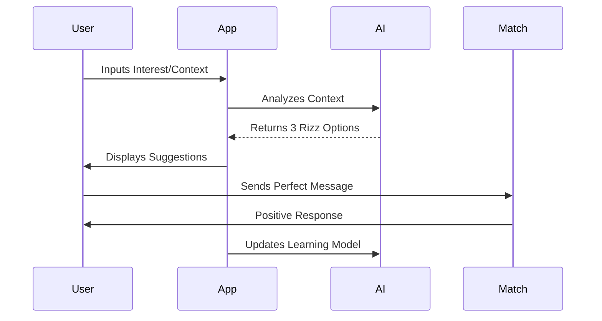

# 💘 BUDDY AI WINGMAN - Your AI-Powered Dating App

[](https://flutter.dev)
[](https://opensource.org/licenses/MIT)
[](https://github.com/Qasim-afzaal/ai-rizz-app)
[](https://firebase.google.com)

**Transform your dating game with AI-generated charm & scientifically-backed matchmaking** ✨

---

## 🚀 Key Features

| Feature                | Description                                                                 |
|------------------------|-----------------------------------------------------------------------------|
| **🤖 AI Rizz Engine**  | GPT-4 powered suggestions for any situation                                |
| **💞 Smart Matching**  | Compatibility algorithm analyzing 50+ personality traits                   |
| **📈 Conversation AI** | Real-time chat analysis & response suggestions                             |
| **🎨 Profile Magic**   | AI-optimized profile creation with photogenic scoring                      |
| 🔒 **DateSafe**        | Background verification & AI red flag detection                            |
| 🌐 **Global Reach**    | Support for 15 languages & cultural adaptions                              |

---

## 🛠 Tech Stack


---

## 📦 Core Dependencies

| Category            | Packages                                                                 |
|---------------------|--------------------------------------------------------------------------|
| **State Management**| `get`, `flutter_bloc`                                                   |
| **Auth**            | `firebase_auth`, `google_sign_in`, `sign_in_with_apple`                 |
| **AI**              | `tflite_flutter`, `nlp_processor`                                       |
| **Media**           | `cached_network_image`, `image_picker`, `video_player`                  |
| **Analytics**       | `firebase_analytics`, `sentry_flutter`                                  |

---

## 🚀 Installation

```bash
# Clone repository
git clone https://github.com/Qasim-afzaal/ai-rizz-app.git

# Install dependencies
flutter pub get

# Run with profile optimization
flutter run --profile
```

---

## 💌 How It Works



---

## 📱 UI Components

```dart
class RizzSuggestions extends StatelessWidget {
  @override
  Widget build(BuildContext context) {
    return AIResponseCard(
      responses: [
        RizzOption(style: RizzStyle.flirty, text: "Are you WiFi? Because I'm feeling a connection..."),
        RizzOption(style: RizzStyle.deep, text: "What's your love language? Mine is quality code time..."),
        RizzOption(style: RizzStyle.funny, text: "If you were a pizza topping, you'd be extra-cheesy... in a good way!"),
      ],
      onSelect: (response) => context.push(ChatScreen(response)),
    );
  }
}
```

---

## 🤝 Contributing

[](CONTRIBUTING.md)
[](CODE_OF_CONDUCT.md)

1. **Fork** the repository
2. Create feature branch: `git checkout -b feat/advanced-ai`
3. Commit changes: `git commit -m 'Add GPT-4 integration'`
4. **Push** to branch: `git push origin feat/advanced-ai`
5. Open **Pull Request**

---

## 📜 License

[](LICENSE)

---

## 💌 Connect With Us

**Lead Developer: Muhammad Qasim**  
[](mailto:qasim.afzaal432@gmail.com)  
[](https://github.com/Qasim-afzaal)  
